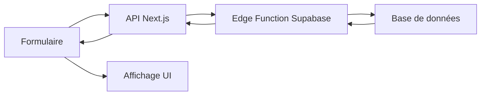

# 🔑 Intégration de l'API de vérification de clé API

## 📋 Vue d'ensemble

Cette documentation décrit l'intégration de la nouvelle Edge Function Supabase pour la vérification des clés API d'entreprise et la récupération des informations associées (nom, logo, statut).

## 🚀 Nouvelle Edge Function

### URL de l'API
```
POST https://mspmrzlqhwpdkkburjiw.supabase.co/functions/v1/employee-auth/verify-api-key
```

### Paramètres d'entrée
```json
{
  "api_key": "partner_c19af714-1d3a-495c-a0db-b3357e00de3c_1755560524503"
}
```

### Réponse en cas de succès
```json
{
  "success": true,
  "partner": {
    "id": "uuid",
    "company_name": "Nom de l'entreprise",
    "logo_url": "https://example.com/logo.png",
    "is_active": true
  },
  "company_name": "Nom de l'entreprise",
  "logo_url": "https://example.com/logo.png",
  "partner_id": "uuid",
  "is_active": true
}
```

### Réponse en cas d'erreur
```json
{
  "success": false,
  "error": "Clé API invalide",
  "message": "Code entreprise invalide ou inexistant"
}
```

## 🔧 Intégration dans Next.js

### API Route créée
**Fichier :** `src/app/api/validate-api-key/route.ts`

Cette route Next.js fait le pont entre le frontend et l'Edge Function Supabase :

```typescript
export async function POST(request: NextRequest) {
  // 1. Validation des paramètres d'entrée
  // 2. Appel de l'Edge Function Supabase
  // 3. Retour des informations formatées
}
```

### Fonctionnalités
- ✅ **Validation CORS** complète
- ✅ **Gestion d'erreurs** robuste
- ✅ **Logging** détaillé
- ✅ **Formatage** des réponses
- ✅ **Sécurité** renforcée

## 🎨 Amélioration de l'interface

### Composant mis à jour
**Fichier :** `src/components/auth/EmployeeRegisterForm.tsx`

### Nouvelles fonctionnalités
- 🖼️ **Affichage du logo** de l'entreprise
- 📊 **Statut de l'entreprise** (Actif/Inactif)
- 🎯 **Validation en temps réel**
- ✨ **Animations fluides**

### Interface utilisateur
```tsx
{partnerInfo && (
  <div className="flex items-center gap-3">
    {partnerInfo.logo_url && (
      
    )}
    <div>
      <p>Code valide pour : {partnerInfo.company_name}</p>
      <p>Statut : {partnerInfo.is_active ? 'Actif' : 'Inactif'}</p>
    </div>
  </div>
)}
```

## 🧪 Tests

### Script de test
**Fichier :** `test-validate-api-key.js`

### Cas de test couverts
1. ✅ **Clé API valide** - Retourne les informations de l'entreprise
2. ❌ **Clé API invalide** - Retourne une erreur appropriée
3. ❌ **Clé API vide** - Validation côté client
4. ❌ **Clé API inexistante** - Gestion des erreurs
5. 🌐 **Test CORS** - Vérification des headers

### Exécution des tests
```bash
node test-validate-api-key.js
```

## 📊 Avantages de cette intégration

### Pour les utilisateurs
- 🎯 **Validation instantanée** du code entreprise
- 🖼️ **Reconnaissance visuelle** avec le logo
- 📊 **Transparence** sur le statut de l'entreprise
- ✨ **Expérience utilisateur** améliorée

### Pour les développeurs
- 🔧 **API centralisée** et réutilisable
- 🛡️ **Sécurité** renforcée avec validation côté serveur
- 📝 **Logging** détaillé pour le debugging
- 🔄 **Maintenance** simplifiée

### Pour l'entreprise
- 🎨 **Image de marque** renforcée avec les logos
- 📈 **Taux de conversion** amélioré
- 🔍 **Traçabilité** des validations
- 🚀 **Performance** optimisée

## 🔄 Flux de données



## 🛠️ Configuration requise

### Variables d'environnement
```env
NEXT_PUBLIC_SUPABASE_URL=https://mspmrzlqhwpdkkburjiw.supabase.co
NEXT_PUBLIC_SUPABASE_ANON_KEY=your_anon_key
```

### Dépendances
- ✅ `@supabase/supabase-js`
- ✅ `next/server`
- ✅ `framer-motion` (pour les animations)

## 🚨 Gestion des erreurs

### Types d'erreurs gérées
1. **Clé API manquante** - Validation côté client
2. **Clé API invalide** - Erreur de l'Edge Function
3. **Entreprise inactive** - Affichage du statut
4. **Erreur réseau** - Message d'erreur générique
5. **Erreur serveur** - Logging et fallback

### Messages d'erreur
- 🔑 "Veuillez fournir une clé API valide"
- ❌ "Code entreprise invalide ou inexistant"
- 🌐 "Erreur de connexion. Veuillez réessayer."
- ⚠️ "Entreprise inactive"

## 📈 Métriques et monitoring

### Logs à surveiller
- 🔍 Tentatives de validation de clé API
- ✅ Validations réussies
- ❌ Validations échouées
- ⏱️ Temps de réponse de l'Edge Function

### KPIs
- **Taux de succès** des validations
- **Temps de réponse** moyen
- **Nombre d'erreurs** par type
- **Utilisation** de l'API

## 🔮 Évolutions futures

### Fonctionnalités envisagées
- 🔄 **Cache** des validations pour améliorer les performances
- 📊 **Analytics** détaillés des validations
- 🔔 **Notifications** en temps réel
- 🎨 **Thèmes** personnalisés par entreprise

### Optimisations possibles
- ⚡ **CDN** pour les logos d'entreprise
- 🔄 **Webhooks** pour les changements de statut
- 📱 **API mobile** dédiée
- 🌐 **Internationalisation** des messages

---

**Date de création :** $(date)  
**Version :** 1.0.0  
**Statut :** ✅ **ACTIF**
